# Chillax by MkDY

**Team:** Ling Li Chien, Loh Thian Le, Ng Zi Yang, Ong Xuanson

**Problem Statement:** Stress & Workload Manager

**Video Presentation:** https://youtu.be/-JhZLtQLMZU

**Presentation Slides:** https://canva.link/jll97h6spzkthjn

## 1. Project Overview

**The Problem.**
Final-year students juggle several kinds of workload at once, not just one: their final-year project (FYP), regular coursework and assignments, exams, a part-time job, job/internship interviews, and personal life — often colliding in the same week with no single view showing that collision until it's too late. Unlike general "student stress," this group's load has a hard end date they're racing against, and existing tools each cover one slice — task lists (Todoist, Notion), or mood logging (Daylio) — but none connect what a student is carrying to what they're actually able to handle right now, and none distinguish between commitments that can be moved (an assignment) and ones that can't (a work shift, an exam).

**Our Solution.**
Chillax is a mobile app built around nine connected functions:
1. **Unified Workload Management** — every task (FYP, assignments, exams, work, interviews, personal) in one place, tagged fixed or flexible
2. **AI Progressive Task Decomposer** — breaks a high-level task into milestones → tasks → micro-actions
3. **Adaptive Capacity Engine** — turns logged tasks + daily check-ins into a single capacity percentage, broken down by five load categories (mental, time, physical, social, errands)
4. **Workload Forecast & Collision Detection** — flags upcoming weeks where multiple fixed/high-priority commitments overlap, before the week starts
5. **AI Rebalancing & Planning Engine** — suggests specific actions on flexible tasks only when capacity is high or a collision is detected (defer, or draft an extension request)
6. **Low-Friction Activity Tracking** — infers task completion instead of demanding manual check-off, follows up only on unconfirmed tasks, and learns real task durations over time
7. **Early Warning & Recovery** — proactive overload alerts naming the specific driving category, plus low-effort recovery suggestions
8. **Adaptive Home Dashboard** — one glanceable screen combining capacity, workload, highest-load category, next collision, today's recommendation, and a confidence indicator
9. **Home Screen Widget** — a Duolingo-style widget for daily engagement outside the app

## 2. Ideation & Process

### 2.1 Ideas We Considered

| Idea | Why it was dropped / kept |
| --- | --- |
| Original MVP: load dashboard + auto-rebalancer, single-feature focus | Kept as the foundation (functions 3, 5, 7), but expanded after mentor feedback flagged it as too close to other teams' entries |
| FYP-only framing for the target group | Dropped — mentor feedback specifically flagged this as too narrow; final-year students' real workload spans coursework, exams, and part-time work too, not just the FYP project |
| Pure mood/stress tracker (no rebalancing) | Dropped — too close to existing apps (Daylio); no action layer |
| Calendar-sync-first version | Reconsidered — reintroduced via Google Calendar API to power collision detection and capacity forecasting against real commitments, rather than relying on manual entry alone |
| Nine-function full system (Chosen) | Adopted after mentor session specifically to build a unique combination of features rather than one standout function, since the core idea alone is common among other teams |

### 2.2 Ideation Boards

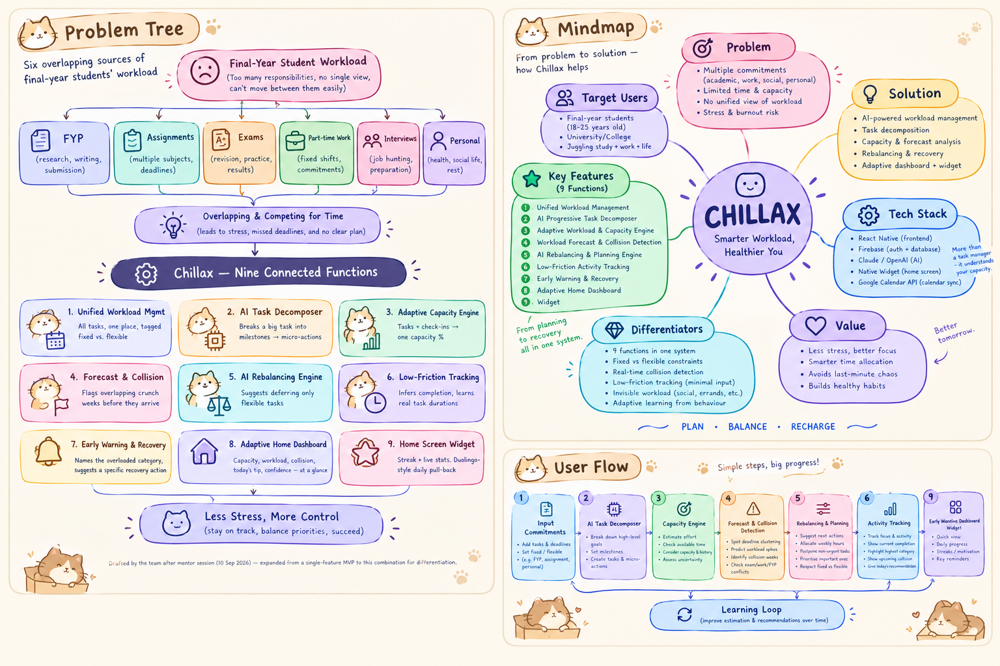

Problem tree showing how the six overlapping sources of a final-year student's workload (FYP, assignments, exams, part-time work, interviews, personal) map down to the nine functions Chillax combines to address them — drafted after the mentor session to visualize the pivot from a single-feature MVP to this combination.

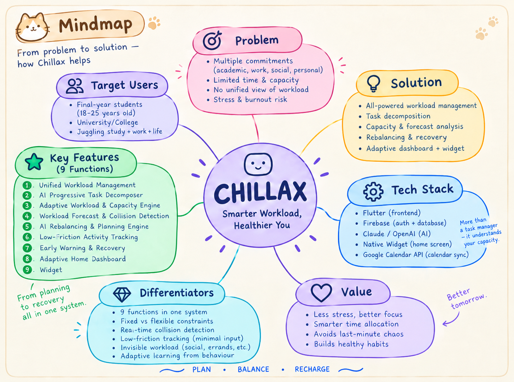

The mind map presents the overall concept of Chillax, connecting the problem, target users, proposed solution, key features, technology, differentiators, and expected value. It shows how the system brings different aspects of a student's workload into one adaptive platform designed to help them plan, balance, and recover.

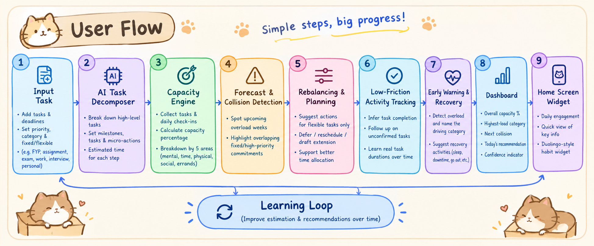

The user flow shows how Chillax manages workload from input to action. Students first add their commitments, after which AI breaks down larger goals and the system estimates capacity, forecasts workload conflicts, and recommends how to rebalance tasks. Activity tracking and early warnings allow the system to learn from the student's behaviour and provide increasingly adaptive recommendations, while the dashboard and widget provide quick access to these insights.

### 2.3 Mentor Consultation

| Date | Mentor | Feedback Received | What Was Changed |
| --- | --- | --- | --- |
| 10 September 2026, 8:50 PM | Looi Wei En | Concept was too common (many teams overlap on this problem statement). Directions given: (1) reduce user input/friction, (2) add a Duolingo-style habit widget, (3) use an AI agent to recommend actions, (4) focus on final-year-student-specific problems beyond just FYP, (5) differentiate via a unique combination of features rather than one standout function | Expanded from a single load-tracker concept to the 9-function system: added task decomposition, collision detection, activity tracking, and the home widget; broadened target framing from FYP-only to the full final-year workload (coursework, exams, shifts, interviews) |

## 3. Design & Prototype

**UI Prototype:** Flutter app (this repo) — screens below

| Screen | Preview |
| --- | --- |
| Onboarding | 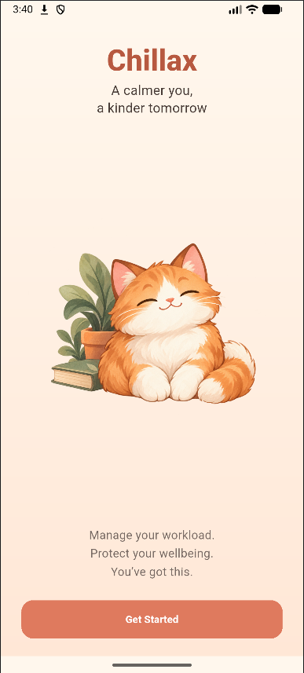 |
| Home — dashboard | 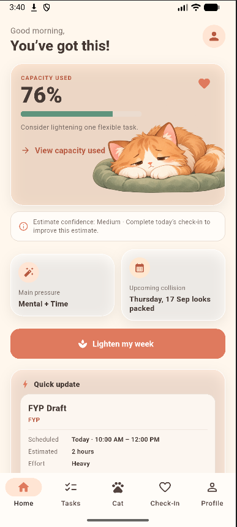 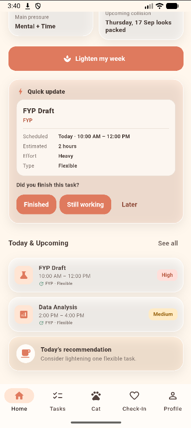 |
| Tasks | 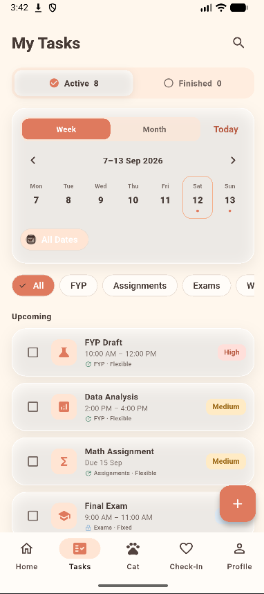 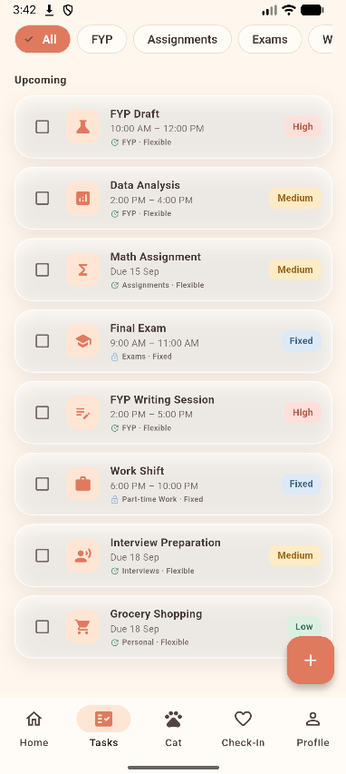 |
| Add Task | 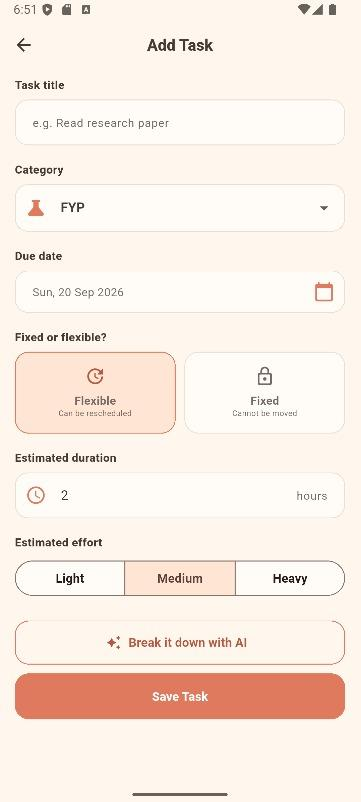 |
| Task Breakdown | 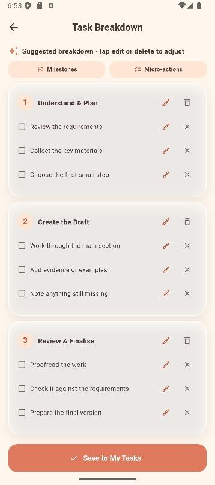 |
| Capacity | 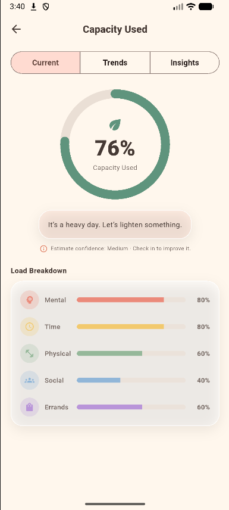 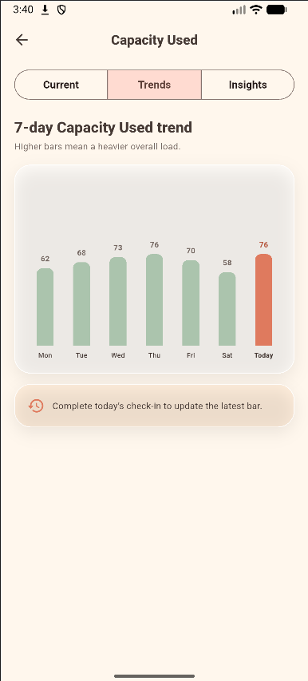 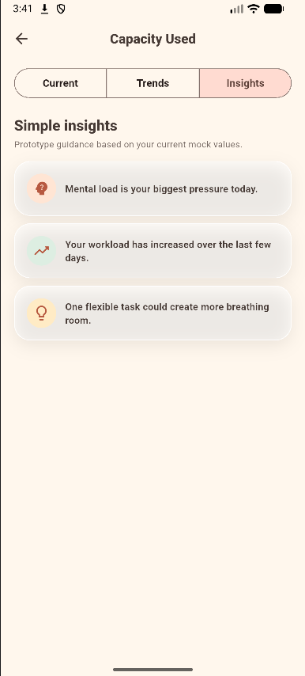 |
| Forecast | 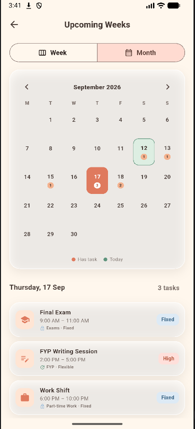 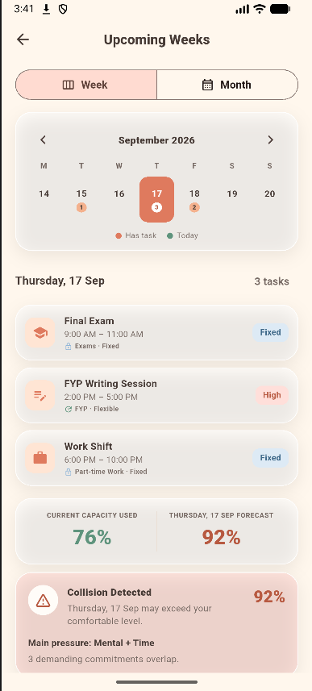 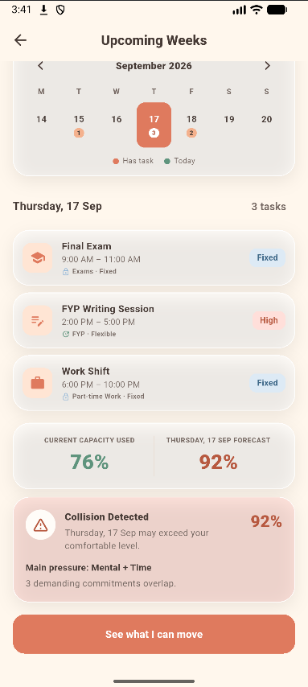 |
| Rebalance | 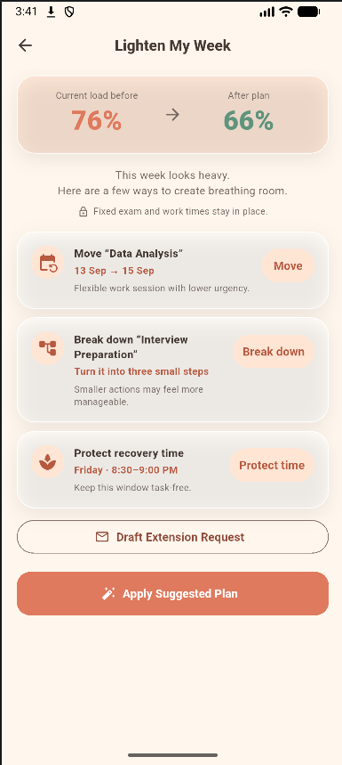 |
| Check-in | 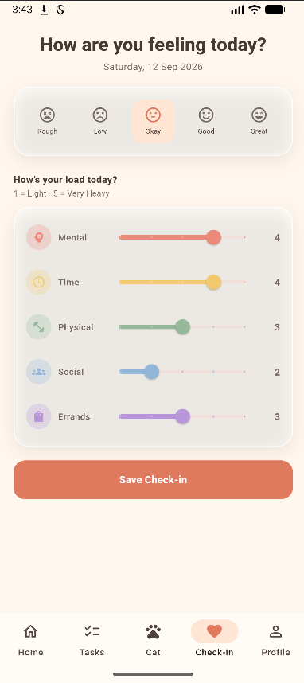 |
| Recovery | 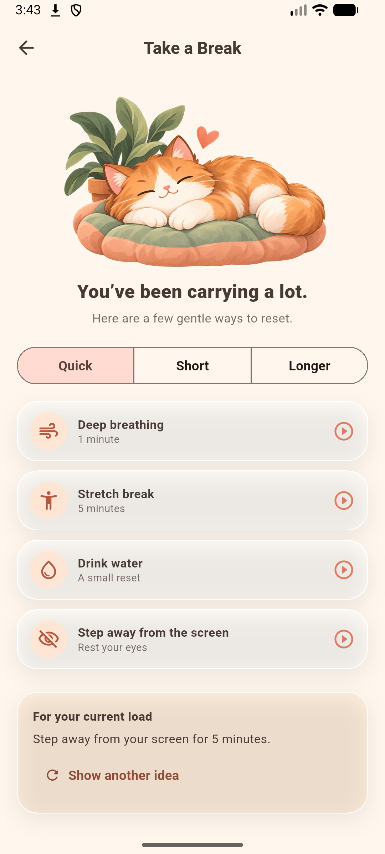 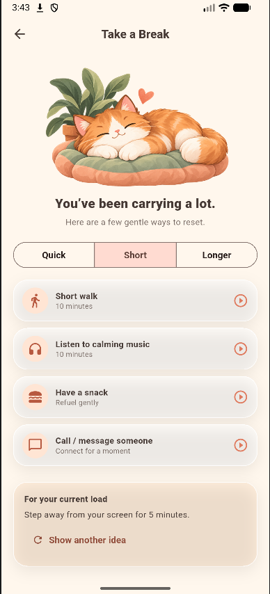 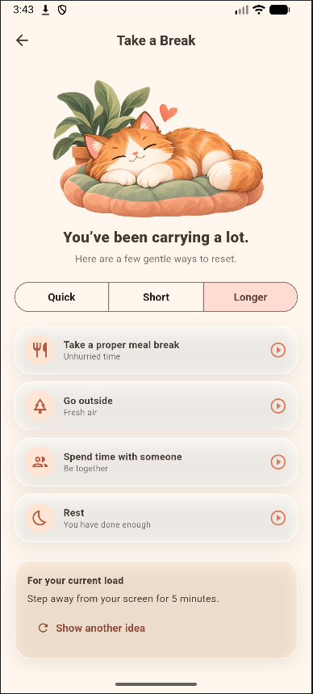 |
| Cat Companion | 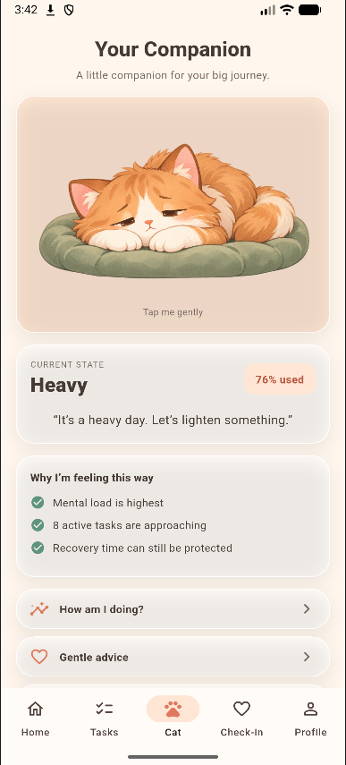 |
| Widget Preview | 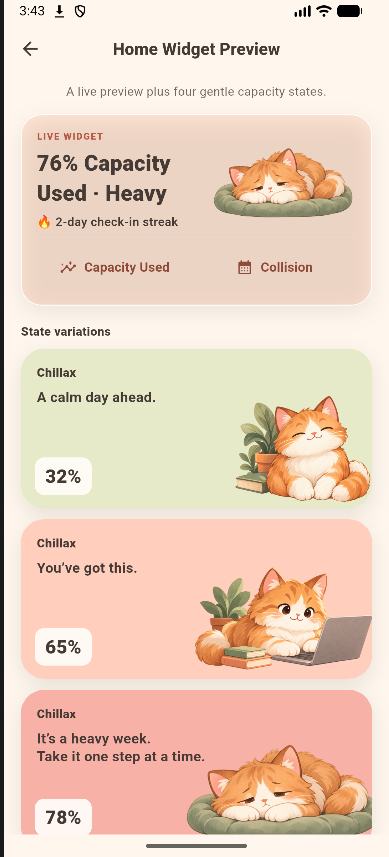 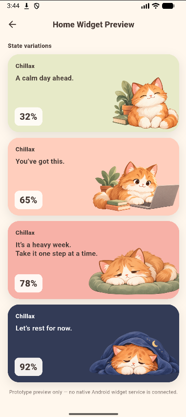 |
| Profile | 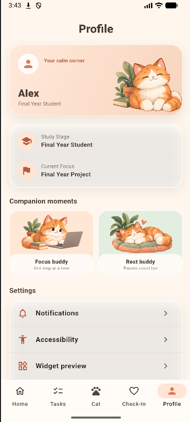 |

## 4. What Makes It Different

- Combines nine functions most competing apps split across separate tools — task management, AI breakdown, forecasting, rebalancing, and recovery all in one connected system
- Fixed-vs-flexible distinction: rebalancing suggestions only ever touch flexible tasks (assignments, FYP milestones), never fixed ones (shifts, exams) — most task apps don't model this at all
- Collision detection surfaces overlapping crunch weeks before they arrive, not after the user is already in them
- Low-friction tracking means the app doesn't demand constant manual input to stay useful
- Weights "invisible load" (social, errands) as seriously as visible load (deadlines)

| Capability | Todoist | Notion | Daylio | Chillax |
| --- | --- | --- | --- | --- |
| Task management | ✓ | ✓ | ✗ | ✓ |
| Mood/stress | ✗ | Limited | ✓ | ✓ |
| Capacity estimation | ✗ | ✗ | ✗ | ✓ |
| Workload forecasting | ✗ | ✗ | ✗ | ✓ |
| Collision detection | Limited | Limited | ✗ | ✓ |
| AI task decomposition | Limited | ✓ | ✗ | ✓ |
| Automatic rebalancing | ✗ | ✗ | ✗ | ✓ |
| Recovery recommendations | ✗ | ✗ | Limited | ✓ |
| Fixed/flexible commitments | ✗ | ✗ | ✗ | ✓ |

## 5. Technical Architecture & Feasibility

**Tech Stack:**
- Frontend: Flutter (Dart) — single codebase for a mobile-first app, already implemented and running as the working prototype
- Backend: Firebase (Auth + Firestore) — planned for the Building Phase; the prototype currently runs on local/mock data, as shown in the Capacity screen's "Insights" tab
- AI functions (Decomposer, Rebalancing Engine): Claude/OpenAI API calls from a lightweight backend function, parsing free-form task input and generating suggestions
- Home Screen Widget: native widget extension (iOS WidgetKit / Android App Widgets), built after the core app since it depends on the same data layer
- Calendar integration: Google Calendar API — pulls existing events to feed the Forecast & Collision Detection engine (function 4) and improve capacity accuracy, rather than relying solely on manually entered tasks

**Build Plan & Scope (3-week Building Phase):**
- Week 1: Data model + Unified Workload Management (function 1) + daily check-in flow (function 7's input side)
- Week 2: Capacity Engine + Collision Detection + Dashboard (functions 3, 4, 8)
- Week 3: Rebalancing Engine + Task Decomposer + Recovery flow + Widget (functions 2, 5, 6, 9), polish and demo prep

*(Deliberately excluded from MVP scope: third-party health data — calendar sync (Google Calendar) is now in scope to support collision detection, per the tech stack above.)*
